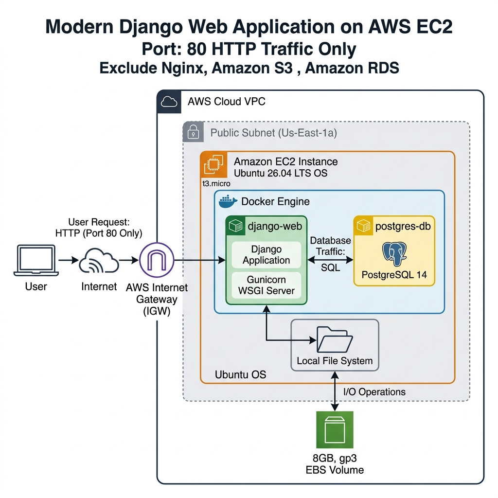
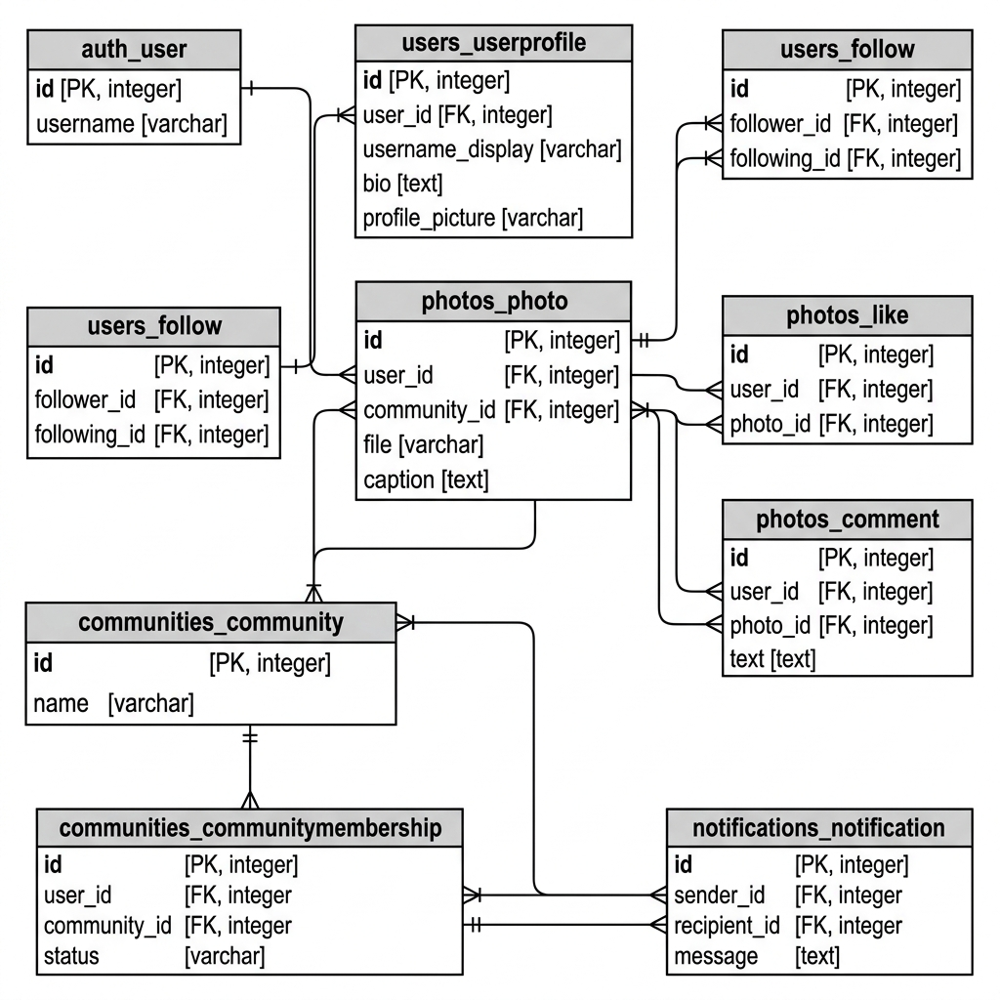

# BSES System Architecture

## 1. System Requirements

The BSES is designed to be a photo sharing and community building application. Based on the foundational requirements in [init.md](file:///Users/msdeep14/Documents/code/bses-v0/init.md), the system must deliver:

- **Robust Authentication & Profiles**: Secure user registration, hidden UUIDs for internal tracking, and public-facing profile usernames (`username_display`).
- **Interactive Feed**: A unified newsfeed combining posts from followed users and joined communities with likes and comments allowed on photos.
- **Community Contexts**: Niche groups allowing users to join, post exclusive content, and invite others.
- **Global Notifications**: Centralized alerts for invites, likes, and comments.
- **Resource Constraints**: The infrastructure must prioritize cost-efficiency.

## 2. Critical Design Decisions

To satisfy both the feature requirements and the aggressive simplicity mandates outlined in [AGENTS.md](file:///Users/msdeep14/Documents/code/bses-v0/AGENTS.md), several deliberate architectural choices were made:

### Framework: Python Django
Django was chosen because of its "batteries-included" philosophy. It provides a robust ORM, built-in admin, and mature templating. This aligns perfectly with the goal of writing fewer lines of code and leveraging existing expertise for rapid iteration, rather than assembling a fragmented micro-framework stack. **I've previous expertise with Python Django, so why not!!!**

### Database: PostgreSQL over SQLite
While SQLite is the Django default, ~~it is unsuitable for a production social media app due to concurrency locking issues when multiple users write (e.g., liking photos simultaneously). PostgreSQL was mandated from Day 1 to ensure data integrity and concurrent transaction support.~~ I've worked with PostgreSQL so went ahead with it.

### Infrastructure: Single EC2 Monolith
To save costs, both the Web Server (Django/Gunicorn) and the Database (PostgreSQL) are deployed as Docker containers on a single AWS EC2 instance (`t3.micro`). A `t2.nano` was initially tested but failed due to Out-Of-Memory (OOM) errors during boot (documented in [execution-v0.md](file:///Users/msdeep14/Documents/code/bses-v0/execution-v0.md)).

### Storage: Local Media over Amazon S3
In keeping with the "simplest possible setup", media files (photos, avatars) are saved directly to the EC2 host's local filesystem rather than Amazon S3. The Docker `volumes` configuration maps the host's `./media` folder into the container, ensuring photos persist across container rebuilds and Git updates. 

### Static Files: WhiteNoise
Gunicorn does not serve static files (CSS/JS) natively. Instead of introducing a complex Nginx container to the stack, we utilized `WhiteNoise`, a lightweight Python middleware that allows the Django application to serve its own static files efficiently in production.

### AI-Driven Development
The application is being built and debugged using advanced AI models (like Gemini 3.1 Pro and earlier implementation plan was created with Claude Opus 4.6). To ensure the AI doesn't over-engineer solutions, strict behavioral constraints are enforced via `AGENTS.md`, and all architectural pivots (like resolving Docker media volume masking) are aggressively logged in `execution-v0.md`.

---

## 3. System Architecture Diagram



---

## 4. High-Level & Low-Level Design

### High-Level Design (Request Flow)
1. **Client Request**: A user navigates to the EC2 Public IP address via their web browser (HTTP over Port 80).
2. **AWS Cloud / EC2 Security Group**: The AWS Security Group intercepts the request. Port 80 is open to the world (`0.0.0.0/0`), allowing the traffic to hit the EC2 instance. (Port 22 is strictly locked to the administrator's local IP).
3. **Docker Environment**: The traffic enters the EC2 host and is routed by Docker's port mapping (`80:8000`) directly into the `web` container.
4. **Gunicorn WSGI**: Gunicorn receives the request on port 8000. If it's a request for a static CSS/JS file, `WhiteNoise` intercepts and serves it immediately.
5. **Django Application**: For dynamic routes, Django processes the request, queries the PostgreSQL `db` container over the internal Docker network, and renders the HTML template.

### Low-Level Design

#### Database Schema & Domain Relations
The Django monolith is cleanly partitioned into domain-specific apps. Below is the Entity-Relationship Diagram (ERD) visually defining the tables, columns, and how the models interact across the system:



<details>
<summary>View DBML Source Code</summary>

```dbml
// https://dbdiagram.io/d/6a182585b62396d22c8ee9b5

Table auth_user {
  id int [primary key]
  username varchar [note: 'Stores hidden UUID']
}

Table users_userprofile {
  id int [primary key]
  user_id int [unique]
  username_display varchar [note: 'Public-facing username for URLs']
  first_name varchar
  last_name varchar
  profile_picture varchar [note: 'File path to image']
  bio text
}

Table users_follow {
  id int [primary key]
  follower_id int
  following_id int
}

Table photos_photo {
  id int [primary key]
  user_id int
  community_id int [null]
  file varchar [note: 'File path to image']
  caption text
  created_at timestamp
}

Table photos_like {
  id int [primary key]
  user_id int
  photo_id int
  created_at timestamp
}

Table photos_comment {
  id int [primary key]
  user_id int
  photo_id int
  text text
  created_at timestamp
}

Table communities_community {
  id int [primary key]
  name varchar
  description text
}

Table communities_communitymembership {
  id int [primary key]
  user_id int
  community_id int
  status varchar
}

Table notifications_notification {
  id int [primary key]
  sender_id int
  recipient_id int
  message text
  is_read boolean
}

// Relationships
Ref: auth_user.id - users_userprofile.user_id
Ref: auth_user.id < users_follow.follower_id
Ref: auth_user.id < users_follow.following_id
Ref: auth_user.id < photos_photo.user_id
Ref: communities_community.id < photos_photo.community_id
Ref: auth_user.id < photos_like.user_id
Ref: photos_photo.id < photos_like.photo_id
Ref: auth_user.id < photos_comment.user_id
Ref: photos_photo.id < photos_comment.photo_id
Ref: auth_user.id < communities_communitymembership.user_id
Ref: communities_community.id < communities_communitymembership.community_id
Ref: auth_user.id < notifications_notification.sender_id
Ref: auth_user.id < notifications_notification.recipient_id
```

</details>

- `users`: Manages `User` (Auth) and `UserProfile` (Followers, Avatars).
- `photos`: Manages `Photo` (Images, Captions), `Like`, and `Comment`.
- `communities`: Manages `Community`, `Membership`, and `Invite`.
- `notifications`: Manages `Notification` (Event tracking).

#### Newsfeed Construction Logic
Rather than executing a massive `JOIN` across the entire database, the Newsfeed uses a targeted approach:
1. It queries the `users` app for a list of UUIDs the current user follows.
2. It queries the `communities` app for a list of Community IDs the user has joined.
3. It fetches `Photo` objects where the `author` is in the followed list, OR the `community` is in the joined list.
4. The result is ordered by `-created_at` and paginated to minimize memory overhead.

#### Media Storage Logic
When a user uploads a photo, Django intercepts the file in memory. The `Pillow` library compresses the image (Quality=85, max 2MB) and normalizes it to RGB. The file is then saved to the local disk using a collision-proof path: `photos/<user_id>/photo_<uuid4>_<epoch>.jpg`. The path is saved in PostgreSQL, while the binary file lives on the EC2 EBS volume.


