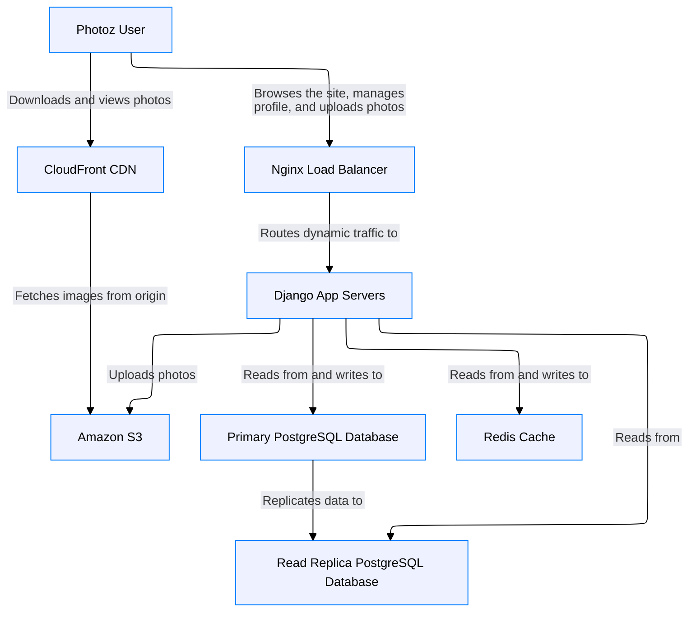

# Welcome to CALM Documentation

This documentation is generated from the **CALM Architecture-as-Code** model.

## High Level Architecture

## Nodes
- [Photoz User](nodes/end-user)
- [Nginx Load Balancer](nodes/load-balancer)
- [Django App Servers](nodes/web-app)
- [Primary PostgreSQL Database](nodes/primary-db)
- [Read Replica PostgreSQL Database](nodes/replica-db)
- [Redis Cache](nodes/cache)
- [CloudFront CDN](nodes/cdn)
- [Amazon S3](nodes/s3)

## Relationships
- [Lb To Webapp](relationships/lb-to-webapp)
- [Webapp To Primarydb](relationships/webapp-to-primarydb)
- [Webapp To Replicadb](relationships/webapp-to-replicadb)
- [Primarydb To Replicadb](relationships/primarydb-to-replicadb)
- [Webapp To Cache](relationships/webapp-to-cache)
- [Webapp To S3](relationships/webapp-to-s3)
- [Cdn To S3](relationships/cdn-to-s3)
- [User To Lb](relationships/user-to-lb)
- [User To Cdn](relationships/user-to-cdn)

## Flows
_No flows defined._

## Metadata

No metadata defined.

## ADRs
_No ADRs defined._
